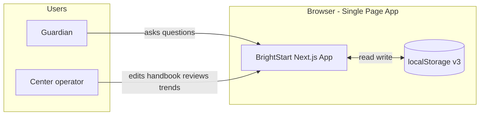
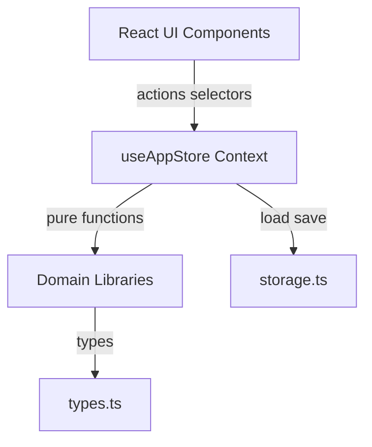
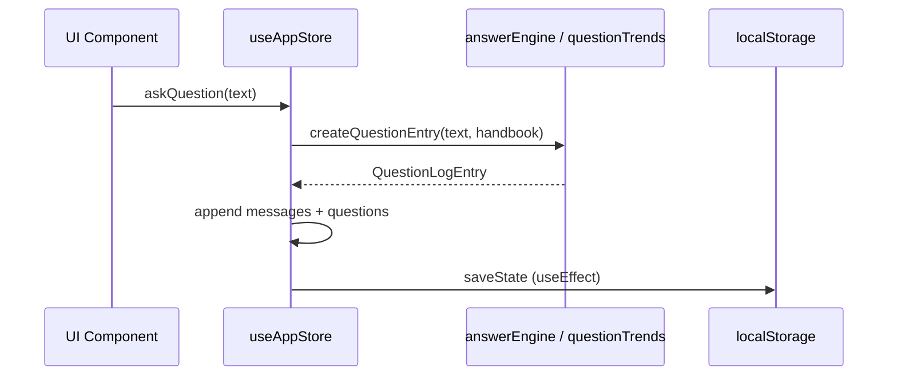
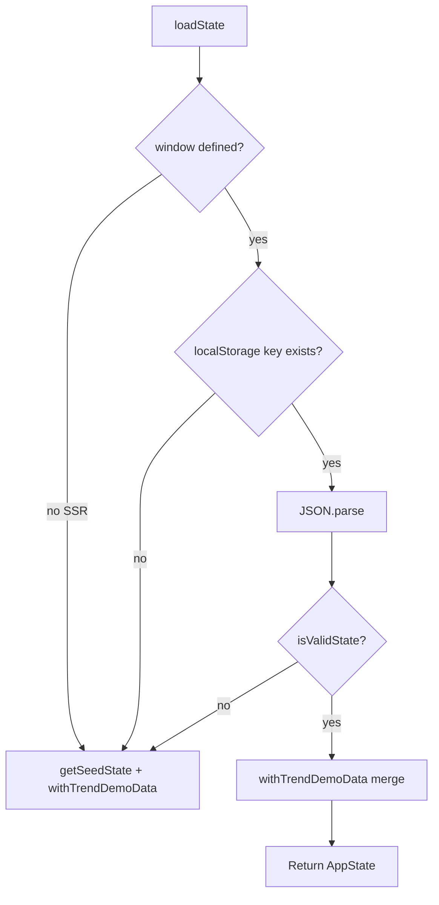
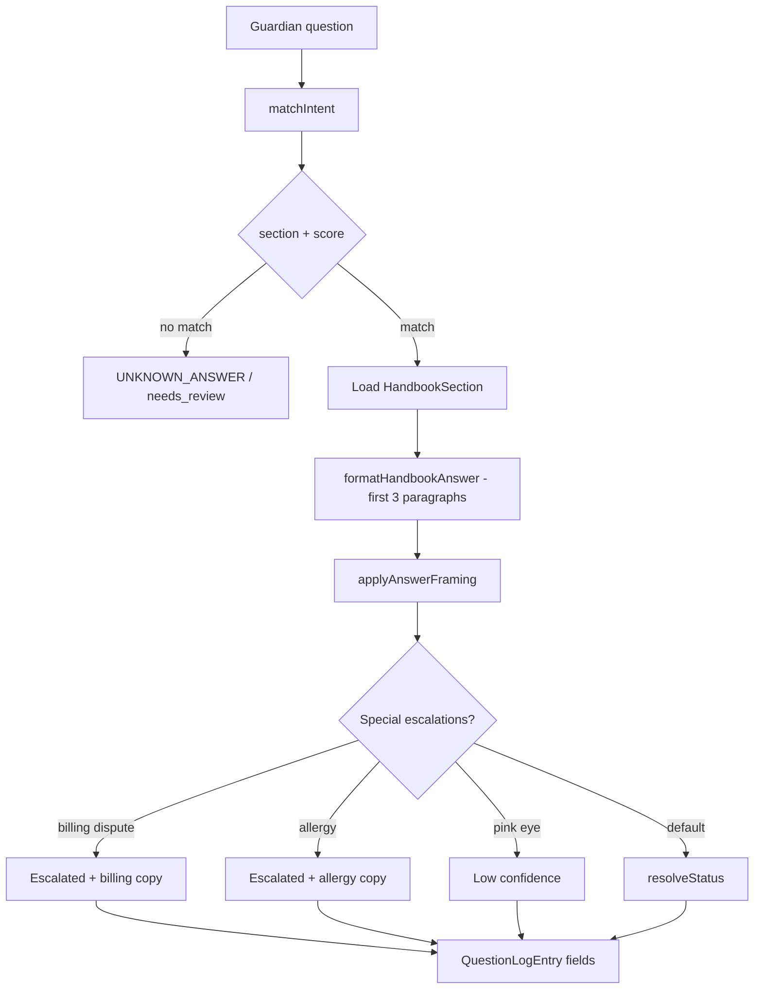
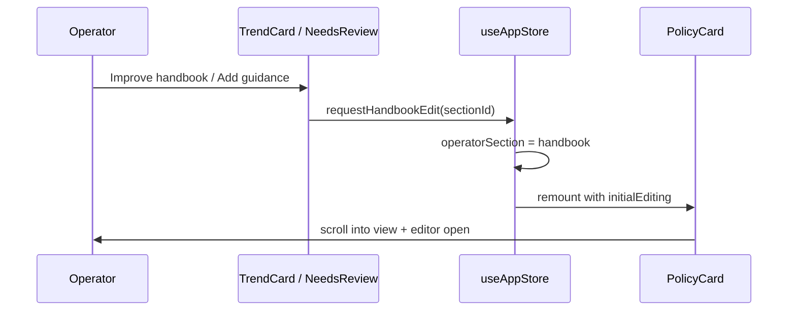

# BrightStart AI Front Desk — Technical Design Document

**Project:** BrightStart AI Front Desk (Brightwheel technical assessment prototype)  
**Center:** Little Sprouts Learning Center (fictional)  
**Version:** 0.1.0  
**Storage schema:** `brightstart-front-desk-v3`  
**Last updated:** May 2026  

---

## Table of contents

1. [Executive summary](#1-executive-summary)
2. [Goals and non-goals](#2-goals-and-non-goals)
3. [System context](#3-system-context)
4. [Architecture overview](#4-architecture-overview)
5. [Technology stack](#5-technology-stack)
6. [Repository structure](#6-repository-structure)
7. [Data model](#7-data-model)
8. [State management](#8-state-management)
9. [Persistence layer](#9-persistence-layer)
10. [Answer engine](#10-answer-engine)
11. [Intent matching](#11-intent-matching)
12. [Trust and safety rules](#12-trust-and-safety-rules)
13. [Suggested improvements](#13-suggested-improvements)
14. [Guardian question trends](#14-guardian-question-trends)
15. [Proactive messaging](#15-proactive-messaging)
16. [Guardian Front Desk (UI)](#16-guardian-front-desk-ui)
17. [Operator Control Center (UI)](#17-operator-control-center-ui)
18. [Application shell and navigation](#18-application-shell-and-navigation)
19. [Design system](#19-design-system)
20. [Accessibility](#20-accessibility)
21. [Security, privacy, and compliance](#21-security-privacy-and-compliance)
22. [Build, deployment, and operations](#22-build-deployment-and-operations)
23. [Extension points and production roadmap](#23-extension-points-and-production-roadmap)
24. [Known limitations](#24-known-limitations)
25. [Appendix](#25-appendix)

---

## 1. Executive summary

BrightStart AI Front Desk is a **client-only** Next.js web application that simulates an AI-powered front desk for a childcare center. Guardians ask questions through a chat interface; the system responds using **deterministic keyword intent matching** and **editable handbook content** as the single source of truth. Operators monitor activity, edit handbook sections, review low-confidence questions, and act on **question trends** via draft outbound messages and handbook improvements.

There is **no backend**, **no authentication**, **no LLM**, and **no network API** for Q&A. All logic runs in the browser; state persists in `localStorage`. The design prioritizes **predictable demos**, **transparent trust signaling** (confidence and status), and **operator control** over content that drives guardian-facing answers.

---

## 2. Goals and non-goals

### Goals

| Goal | How it is met |
|------|----------------|
| Fast guardian self-service | Chat + quick-question chips; answers from handbook excerpts |
| Handbook as source of truth | Nine editable sections; answers regenerate when handbook changes |
| Operator visibility | Metrics, recent questions, needs-review queue, trends |
| Trustworthy UX | Confidence levels, escalation paths, sensitive-topic handling |
| Brightwheel-adjacent UI | Sidebar layout, design tokens, Inter typography |
| Zero external dependencies for AI | Keyword matcher + rule engine only |
| Demo-ready on first load | Seeded handbook, question history, and proactive updates |

### Non-goals (explicitly out of scope)

- Real authentication or multi-tenant centers
- Production messaging (SMS, email, push) — “Mark as sent” logs intent only
- LLM / RAG / vector search
- Server-side persistence or sync across devices
- Real child or family PII
- Billing integration, rostering, or Brightwheel product APIs
- Automated handbook versioning, approval workflows, or audit logs

---

## 3. System context



**Deployment target:** Static/SSR-capable Next.js on Vercel (or any Node host). No environment variables required for core functionality.

---

## 4. Architecture overview

The application follows a **layered, unidirectional data flow**:



### Layers

| Layer | Responsibility | Key modules |
|-------|----------------|-------------|
| **Presentation** | React components, layout, a11y | `src/components/**` |
| **Application state** | Single source of truth, derived metrics | `src/hooks/useAppStore.tsx` |
| **Domain** | Answer generation, trends, matching, seeds | `src/lib/**` |
| **Persistence** | `localStorage` serialization, migration | `src/lib/storage.ts` |

### Runtime boundaries

- **Server:** Next.js renders shell (`layout.tsx`, `page.tsx`); no server actions for app logic.
- **Client:** All interactive features are `"use client"` components under `AppStoreProvider`.
- **Hydration:** Store initializes from `getSeedState()` on server/first paint, then `loadState()` on mount to avoid SSR/localStorage mismatch for persisted data. `mounted` flag gates chat rendering until client load completes.

---

## 5. Technology stack

| Category | Choice | Version (approx.) | Rationale |
|----------|--------|-------------------|-----------|
| Framework | Next.js (App Router) | 16.x | File-based routing, static export friendly, `app/icon.svg` |
| UI | React | 19.x | Concurrent features; client components |
| Language | TypeScript | 5.x | Strict typing for domain models |
| Styling | Tailwind CSS | 4.x | Utility-first; `@theme inline` tokens |
| Font | Inter via `next/font/google` | — | Brightwheel-adjacent typography |
| Persistence | `localStorage` | — | Prototype simplicity |
| Lint | ESLint + `eslint-config-next` | 9.x | Next.js defaults |

**No additional runtime dependencies** (no Redux, Zustand, React Query, OpenAI SDK, etc.).

---

## 6. Repository structure

```
BrightwheelAssessment/
├── TECHNICAL_DESIGN.md          # This document
├── README.md
├── package.json
├── tsconfig.json
├── next.config.ts               # (if present)
├── public/                      # Static assets (minimal)
└── src/
    ├── app/
    │   ├── layout.tsx           # Root layout, metadata, Inter font
    │   ├── page.tsx             # Entry → AppShell
    │   ├── globals.css          # Design tokens + utilities
    │   ├── icon.svg             # Favicon (sun logo on sidebar purple)
    │   └── apple-icon.svg
    ├── components/
    │   ├── AppShell.tsx         # Layout: sidebar + main + footer
    │   ├── sidebar/             # Primary nav (guardian / operator)
    │   ├── guardian/            # Guardian Front Desk
    │   ├── operator/            # Operator Control Center + trends/
    │   └── ui/                  # Button, Card, Badge primitives
    ├── hooks/
    │   └── useAppStore.tsx      # Global state + actions
    └── lib/
        ├── types.ts             # Domain types + STORAGE_KEY
        ├── seed.ts              # Handbook + quick chips + getSeedState
        ├── seedQuestionHistory.ts
        ├── storage.ts
        ├── navigation.ts
        ├── operatorSections.ts
        ├── intentMatcher.ts
        ├── answerEngine.ts
        ├── trustRules.ts
        ├── suggestedImprovements.ts
        ├── questionTrends.ts
        ├── proactiveMessages.ts
        ├── formatTime.ts
        └── fonts.ts
```

---

## 7. Data model

All domain types live in `src/lib/types.ts`.

### 7.1 Handbook

```typescript
HandbookSectionId =
  | "hours" | "illness" | "medication" | "pickup" | "nutrition"
  | "tuition" | "tour" | "behavior" | "special";

HandbookSection = {
  id: HandbookSectionId;
  title: string;              // e.g. "Hours & Holidays"
  handbookCategory: string; // e.g. "Operations"
  body: string;               // Plain text, paragraph-separated
  lastUpdated: string;        // ISO date YYYY-MM-DD
};
```

The handbook is the **authoritative content** for answers. Operators edit `body` in place; `lastUpdated` updates on save.

### 7.2 Question log entry

Each guardian question produces one `QuestionLogEntry` (also embedded in assistant chat messages):

```typescript
QuestionLogEntry = {
  id: string;                    // crypto.randomUUID()
  question: string;
  answer: string;
  sourceLabel: string | null;    // Handbook section title when matched
  confidence: "high" | "medium" | "low";
  status: "answered" | "escalated" | "needs_review";
  sectionId: HandbookSectionId | null;
  isSensitive: boolean;
  timestamp: string;             // ISO datetime
  escalationNote?: string;
  suggestedImprovement?: string; // Operator-facing handbook gap hint
};
```

### 7.3 Chat messages (discriminated union)

```typescript
ChatMessage =
  | { id; role: "guardian"; text; timestamp }
  | { id; role: "assistant"; entry: QuestionLogEntry; timestamp };
```

Guardian messages store raw text; assistant messages store the full `QuestionLogEntry` so the chat can render answers without re-deriving.

### 7.4 Proactive updates

Logged when operators “send” draft reminders/updates (prototype: no real send):

```typescript
ProactiveUpdate = {
  id; title; message;
  sectionId: HandbookSectionId | null;
  type: "reminder" | "update" | "handbook";
  sentAt: string; // ISO
};
```

### 7.5 Question trends (derived, not persisted)

`QuestionTrend` is computed at runtime by `computeQuestionTrends()` — not stored in `AppState`.

### 7.6 Application state (`AppState`)

```typescript
AppState = {
  handbookSections: HandbookSection[];
  questions: QuestionLogEntry[];      // Newest first (prepended)
  messages: ChatMessage[];
  proactiveUpdates: ProactiveUpdate[];
};
```

**Persisted:** entire `AppState` JSON under key `brightstart-front-desk-v3`.

**Ephemeral (React state in `useAppStore`, not in `AppState`):**

| Field | Purpose |
|-------|---------|
| `mounted` | Client hydration guard |
| `focusSectionId` | Highlight + scroll target for handbook |
| `operatorSection` | Active operator tab panel |
| `handbookEditRequestId` | Monotonic counter to force edit-mode open |
| `lastActionNotice` | Toast text after operator actions |

---

## 8. State management

### 8.1 Pattern

**React Context + `useReducer`-style manual updates** via `useState` in `AppStoreProvider`. A single `useAppStore()` hook exposes state and actions to all client components.



### 8.2 Derived state (useMemo)

| Selector | Computation |
|----------|-------------|
| `metrics` | Filter `questions` where `isToday`; count confident, review, escalated |
| `needsReview` | Filter via `needsReviewEntry(status, confidence, isSensitive)` |
| `questionTrends` | `computeQuestionTrends(questions)` |

Derived data is **not persisted**; recomputed on each render when dependencies change.

### 8.3 Actions reference

| Action | Effect |
|--------|--------|
| `askQuestion` | Creates guardian + assistant messages; prepends `QuestionLogEntry` |
| `updateHandbookSection` | Updates section body; **refreshes all Q&A** via `refreshAnswersForHandbook` |
| `appendHandbookGuidance` | Appends paragraph if not duplicate; refreshes Q&A |
| `markProactiveSent` | Prepends `ProactiveUpdate`; sets notice |
| `requestHandbookEdit` | Sets focus, increments edit request id, switches to handbook tab |
| `clearHandbookFocus` | Clears handbook highlight |
| `setOperatorSection` | Changes operator sub-tab |
| `resetDemo` | Clears storage; reloads `getSeedState()`; resets ephemeral UI state |
| `clearActionNotice` | Clears toast (also auto-clears after 4s) |

### 8.4 Handbook–answer synchronization

When handbook content changes, `refreshAnswersForHandbook` re-runs `generateAnswer` for **every** historical question and updates both `questions[]` and assistant `messages[].entry`. This keeps guardian chat and operator lists consistent with the current handbook.

**Design tradeoff:** O(n) regeneration on every edit; acceptable for prototype scale (~tens–hundreds of entries).

---

## 9. Persistence layer

**Module:** `src/lib/storage.ts`  
**Key:** `brightstart-front-desk-v3` (`STORAGE_KEY` in `types.ts`)

### 9.1 Load path



### 9.2 Validation (`isValidState`)

- Rejects legacy shapes containing `policies` (pre-handbook migration).
- Requires `handbookSections` array with **≥ 9** sections.
- Requires `questions` array (may be empty).

Invalid or missing data → full seed via `getSeedState()`.

### 9.3 Trend demo merge (`withTrendDemoData`)

If fewer than **3** trend cards would render (`computeQuestionTrends`), merges **stable-id** seed questions from `getSeedQuestionHistory()` without duplicating IDs.

If `proactiveUpdates` is empty, merges seed proactive updates similarly.

Ensures Operator **Guardian Question Trends** tab is demo-ready even when users only used Guardian chat and generated no trend-eligible history.

### 9.4 Message migration

Legacy chat messages with `role: "parent"` are normalized to `role: "guardian"` on load.

### 9.5 Save path

`useEffect` writes full `state` to `localStorage` whenever `state` changes after `mounted === true`. No debouncing; synchronous JSON.stringify.

### 9.6 Versioning strategy

Storage key bump (`v2` → `v3`) forces fresh seed for new fields (`proactiveUpdates`, seeded questions). No incremental migration beyond rejecting invalid shapes.

---

## 10. Answer engine

**Module:** `src/lib/answerEngine.ts`

### 10.1 Pipeline



### 10.2 Answer body source

Answers use **`formatHandbookAnswer(section.body)`** — up to three `\n\n`-separated paragraphs from the live handbook. Hardcoded per-topic templates were removed so **operator edits immediately affect** new and refreshed answers.

### 10.3 Confidence scoring

| Condition | Confidence |
|-----------|------------|
| Intent score ≥ 2 | `high` |
| Intent score === 1 | `medium` |
| Intent score 0 / no section | `low` |
| Pink eye / conjunctivitis (illness) | Forced `low` |
| Billing dispute keywords (tuition) | Capped / escalated |
| Allergy keywords | Escalated |
| Sensitive topic | High → medium via `capConfidenceForSensitive` |

### 10.4 Answer framing

- **Medium:** Prefix `"Based on our current handbook guidance, "`
- **Sensitive (non-low):** Prefix `"Based on our {sectionTitle} handbook section, "` + `SENSITIVE_FOOTER`
- **Low:** No prefix change; status `needs_review`

### 10.5 Public API

| Function | Purpose |
|----------|---------|
| `createQuestionEntry` | New question with id + timestamp |
| `refreshQuestionEntry` | Re-generate one entry from current handbook |
| `refreshAnswersForHandbook` | Batch refresh questions + chat messages |

---

## 11. Intent matching

**Module:** `src/lib/intentMatcher.ts`

### 11.1 Algorithm

1. Normalize question to lowercase.
2. For each `HandbookSectionId`, score keyword hits in `SECTION_KEYWORDS`.
   - Single-word keyword: +1
   - Multi-word phrase: +2
3. Select section with **highest score** (ties: last winning section in iteration order).
4. `detectSensitive`: global sensitive keywords OR section in `SENSITIVE_SECTIONS` (illness, medication, pickup).

### 11.2 Section keyword map

Nine sections each maintain 10–20 keywords/phrases (e.g. `hours` → "veterans day", "holiday", "closed"; `nutrition` → "lunch", "forgot lunch").

### 11.3 Special detectors

| Function | Triggers |
|----------|----------|
| `isBillingDispute` | "dispute", "overcharged", "refund", etc. |
| `isAllergyQuestion` | "allergy", "allergies" |

These force escalation paths independent of confidence heuristics.

---

## 12. Trust and safety rules

**Module:** `src/lib/trustRules.ts`

### 12.1 Confidence → status

| Rule | Result |
|------|--------|
| Escalated flag | `status: "escalated"` |
| Low confidence | `needs_review` |
| Sensitive + medium | `answered` (with footer) |
| Otherwise | `answered` |

### 12.2 Needs-review queue (operator)

`needsReviewEntry` returns true when:

- `status === "needs_review"` OR
- `status === "escalated"` OR
- `(isSensitive && confidence !== "high")`

### 12.3 Copy constants

- `UNKNOWN_ANSWER` — no confident handbook match
- `SENSITIVE_FOOTER` — directs guardian to contact staff
- `TRUST_RULES` — static list rendered in Operator **Trust rules** tab

### 12.4 Guardian-facing simplification

Guardian chat **AnswerCard** shows only the answer text (no confidence badges, source labels, or escalation UI). Operators see full metadata in Activity views.

---

## 13. Suggested improvements

**Module:** `src/lib/suggestedImprovements.ts`

Rule-based handbook gap hints for operators:

1. **Keyword rules** — e.g. pink eye, strep, custody → specific suggestion strings.
2. **Section defaults** — when confidence is low or score is weak, suggest section-specific expansions.
3. **Fallback** — "Consider adding a handbook section for this topic" when unmatched.

Attached to `QuestionLogEntry.suggestedImprovement` and shown in **Needs Review**.

---

## 14. Guardian question trends

**Module:** `src/lib/questionTrends.ts`  
**Time helpers:** `isThisWeek`, `isLastWeek` (Monday-start weeks) in `formatTime.ts`

### 14.1 Curated trends

Only three trend **archetypes** are configured (not all nine sections):

| sectionId | Display title | actionType | Min this-week count |
|-----------|---------------|------------|---------------------|
| `hours` | Holiday Schedule | `draft_reminder` | 3 |
| `nutrition` | Meals & Lunch | `draft_update` | 3 |
| `illness` | Health & Illness | `improve_handbook` | 3 |

### 14.2 Trend label logic

| Condition | Label |
|-----------|-------|
| Illness + count ≥ 3 | `recurring` |
| Last week = 0 | `new` or `rising` |
| Otherwise | `+N%` or `steady` |

### 14.3 Output cap

Sort by `countThisWeek` descending; return **top 3** trends.

### 14.4 Common questions

Up to three distinct question strings per trend, ordered by frequency this week.

---

## 15. Proactive messaging

**Module:** `src/lib/proactiveMessages.ts`

| Action type | Template |
|-------------|----------|
| `draft_reminder` | Veterans Day closure (Little Sprouts) |
| `draft_update` | Emergency lunch menu + allergy line |
| `improve_handbook` | `ILLNESS_HANDBOOK_APPEND` paragraph appended to handbook |

`getDraftForTrend(trend)` supplies modal defaults. **Mark as sent** records `ProactiveUpdate` only.

---

## 16. Guardian Front Desk (UI)

**Entry:** `GuardianFrontDesk.tsx`  
**Layout:** Centered column `max-w-md` inside `max-w-5xl` main container.

### Components

| Component | Role |
|-----------|------|
| `QuickChips` | Eight seeded prompts from `QUICK_CHIPS` |
| `ChatWindow` | Message list; `role="log"` + `aria-live="polite"` |
| `ChatInput` | Form with labeled text field |
| `MessageBubble` | Guardian messages (right-aligned) |
| `AnswerCard` | Assistant replies (`<article>`) |

### Flow

1. Guardian submits chip or typed question.
2. `askQuestion` → assistant entry appears in chat.
3. Chat auto-scrolls to bottom on new messages.

### Hydration

Until `mounted`, chat shows loading status (avoids empty flash before `localStorage` load).

---

## 17. Operator Control Center (UI)

**Entry:** `OperatorControlCenter.tsx`

### Layout model

```text
┌─────────────────────────────────────────────┐
│ Page title (AppShell, max-w-5xl)            │
├─────────────────────────────────────────────┤
│ STICKY: MetricsRow + OperatorSectionTabs    │
├─────────────────────────────────────────────┤
│ SCROLL: Active tab panel                    │
│   Activity | Handbook | Trends | Trust      │
└─────────────────────────────────────────────┘
```

Operator uses **`h-dvh` flex column** with sticky header and scrollable panel (`overflow-y-auto`).

### Tab panels

| Tab | Content |
|-----|---------|
| **Activity** | `RecentQuestions` + `NeedsReview` (two-column on lg) |
| **Handbook** | Nine `PolicyCard` editors (source of truth) |
| **Guardian Question Trends** | `GuardianQuestionTrends` + trend cards |
| **Trust rules** | Static `TRUST_RULES` list |

All panels stay in DOM with `hidden` + `aria-labelledby` for accessibility; only one visible.

### Handbook edit flow



`handbookEditRequestId` increments on each request so repeated clicks re-open edit mode.

### Metrics row

Four cards: questions today, answered confidently, needs review, escalated — all filtered to **today** via `isToday`.

---

## 18. Application shell and navigation

**Module:** `AppShell.tsx`, `Sidebar.tsx`, `navigation.ts`

### Primary navigation

| Tab ID | Label | Hash |
|--------|-------|------|
| `guardian` | Guardian Front Desk | `#guardian` |
| `operator` | Operator Control Center | `#operator` |

Legacy `#parent` hash maps to `guardian`.

### Layout

- **Desktop:** Fixed-width sidebar (`280px`), sticky, purple (`#5b6fe5`), rounded right edge.
- **Mobile:** Top bar + drawer sidebar; overlay dismiss.

### Page title alignment

Desktop `h1` is rendered once in `AppShell` inside `mx-auto max-w-5xl` for **both** tabs so titles align identically.

---

## 19. Design system

**Tokens:** `src/app/globals.css` (`:root` + `@theme inline`)

| Token | Usage |
|-------|--------|
| `bw-primary` | CTAs, links |
| `bw-navy` | Headings |
| `bw-body` / `bw-muted` | Body copy |
| `bw-panel` / `bw-card` | Surfaces |
| `bw-sidebar` | Navigation chrome |
| `shadow-bw` | Card elevation |

**Primitives:** `Button` (primary/secondary/ghost), `Card`, `Badge` variants (confidence, status, category, handbook source).

**Typography utilities:** `.text-section-title`, `.text-card-title`, `.text-label`, `.text-body`

**Font:** Inter via `next/font` in `layout.tsx` / `fonts.ts`

---

## 20. Accessibility

| Area | Implementation |
|------|----------------|
| Skip link | "Skip to main content" → `#main-content` |
| Landmarks | `<main>`, `<nav>`, `<header>`, `<footer>`, `<aside>` |
| Operator tabs | `role="tablist"`, `role="tab"`, `aria-selected`, `aria-controls`, `hidden` panels |
| Modal | `role="dialog"`, `aria-modal`, labelled title, backdrop button |
| Chat | `role="log"`, `aria-live="polite"` |
| Forms | `<label>` / `sr-only` for inputs |
| Badges | `aria-label` on confidence/status/category |
| Icons | `aria-hidden` on decorative SVGs |
| Mobile menu | `aria-expanded`, `aria-controls` |

**Gaps / future work:** Focus trap in modal; `aria-live` for operator toast; reduced-motion preferences; full keyboard roving tabindex on tab list.

---

## 21. Security, privacy, and compliance

| Topic | Posture |
|-------|---------|
| Authentication | None — anyone with URL can use app |
| Data residency | Browser only; no transmission |
| PII | Fictional demo content only |
| XSS | React escaping; handbook is plain text (operator-edited) |
| CSRF / APIs | N/A — no server mutations |
| `localStorage` | Readable by any script on origin; not for real PHI |

**Prototype footer:** "No real child or family data is used."

---

## 22. Build, deployment, and operations

### Commands

```bash
npm install
npm run dev      # Development
npm run build    # Production build
npm start        # Production server
npm run lint     # ESLint
```

### Next.js outputs

- Static prerender for `/`, `/_not-found`
- `icon.svg` served as app icon route

### Vercel deployment

Default Next.js settings; no env vars. Suitable for static assessment hosting.

### Observability

None (no logging, analytics, or error reporting hooks).

---

## 23. Extension points and production roadmap

| Area | Prototype | Production direction |
|------|-----------|----------------------|
| Q&A brain | Keyword matcher | LLM + RAG on handbook chunks with citations |
| Persistence | localStorage | Postgres + center_id tenancy |
| Auth | None | Brightwheel SSO / role-based access |
| Messaging | Log only | Email/SMS/push via provider |
| Trends | Client aggregation | Warehouse / scheduled analytics |
| Handbook | Plain text | Rich text / versioned CMS + approval |
| Multi-center | Single seed | Per-center handbook + branding |
| Answer refresh | Full recompute | Incremental cache invalidation by section |
| Tests | None | Unit tests for matcher, engine, trends; E2E for flows |

### Suggested module boundaries for backend extraction

1. **Handbook service** — CRUD sections, versioning  
2. **Q&A service** — question → answer + metadata  
3. **Analytics service** — trends, metrics  
4. **Comms service** — proactive message drafts + delivery  

Keep `QuestionLogEntry` shape stable as API contract for operator UI.

---

## 24. Known limitations

1. **Keyword matcher ambiguity** — Overlapping keywords across sections; last highest score wins; no NLP disambiguation.
2. **No multi-turn context** — Each question is independent.
3. **localStorage size** — Large chat histories may hit quota; no pruning.
4. **No conflict resolution** — Single browser profile only.
5. **Seeded trends merge** — May surprise users who cleared history but still see demo trends until they exceed thresholds.
6. **Billing dispute detector** — Broad `"dispute"` keyword may false-positive.
7. **Operator metrics** — "Today" uses client local timezone only.
8. **SSR/hydration** — Brief loading state in chat on first paint.
9. **No automated tests** in repository.
10. **ESLint** — Some `react-hooks/set-state-in-effect` warnings on intentional navigation effects.

---

## 25. Appendix

### 25.1 Seed content sources

| Module | Contents |
|--------|----------|
| `seed.ts` | `CENTER_NAME`, `CENTER_INTRO`, `QUICK_CHIPS`, nine `seedHandbookSections` |
| `seedQuestionHistory.ts` | ~21 questions (hours/nutrition/illness), week-relative timestamps; sample proactive updates |

### 25.2 Operator section order

Defined in `OPERATOR_SECTIONS`: Activity → Handbook → Guardian Question Trends → Trust rules. Default panel: **Activity**.

### 25.3 File → responsibility quick reference

| File | Responsibility |
|------|----------------|
| `useAppStore.tsx` | Global state, persistence sync, actions |
| `answerEngine.ts` | Q&A generation + refresh |
| `intentMatcher.ts` | Section classification |
| `trustRules.ts` | Confidence/status policy |
| `questionTrends.ts` | Trend cards |
| `storage.ts` | localStorage I/O + demo merge |
| `AppShell.tsx` | App chrome + routing |
| `OperatorControlCenter.tsx` | Operator dashboard shell |
| `GuardianFrontDesk.tsx` | Guardian chat shell |

### 25.4 Example `AppState` JSON shape (abbreviated)

```json
{
  "handbookSections": [
    {
      "id": "hours",
      "title": "Hours & Holidays",
      "handbookCategory": "Operations",
      "body": "Open Monday–Friday...",
      "lastUpdated": "2026-05-18"
    }
  ],
  "questions": [
    {
      "id": "uuid",
      "question": "Are you open on Veterans Day?",
      "answer": "Based on our current handbook guidance, ...",
      "sourceLabel": "Hours & Holidays",
      "confidence": "high",
      "status": "answered",
      "sectionId": "hours",
      "isSensitive": false,
      "timestamp": "2026-05-18T14:00:00.000Z"
    }
  ],
  "messages": [],
  "proactiveUpdates": []
}
```

---

*This document describes the BrightStart AI Front Desk prototype as implemented in the repository. For setup and feature overview, see [README.md](./README.md).*
